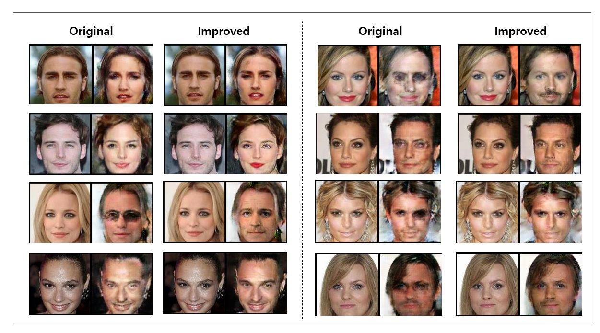
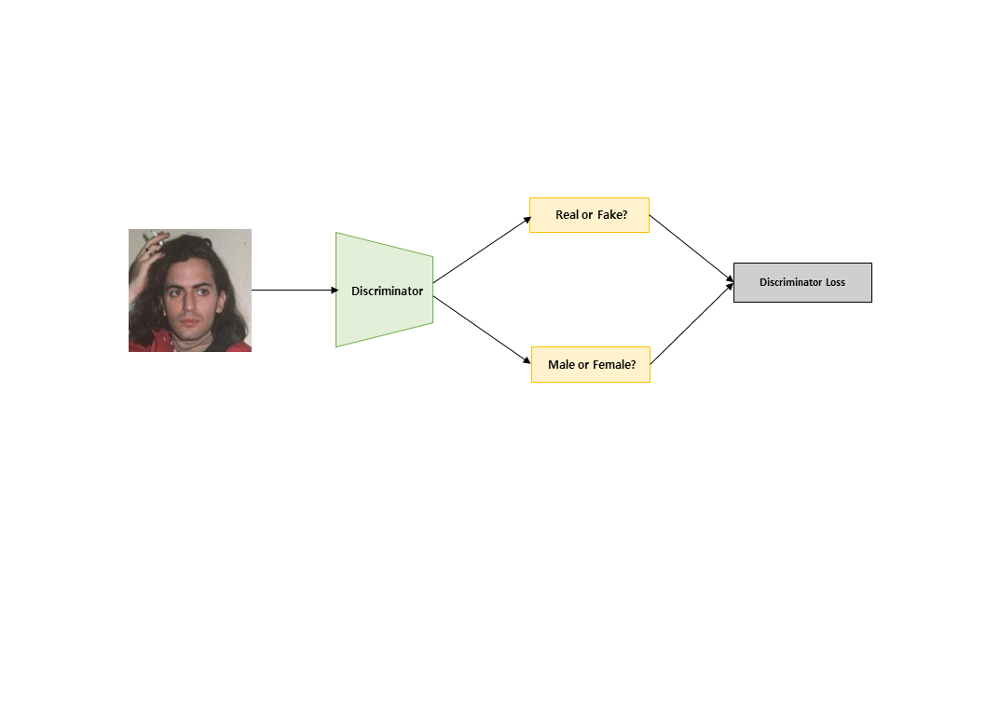
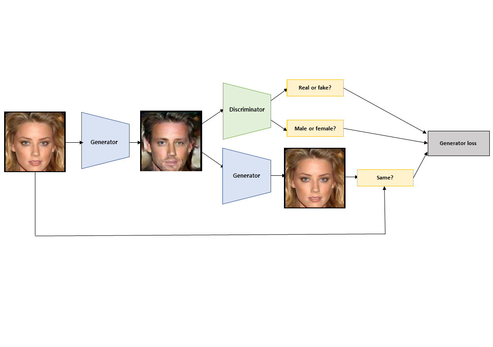
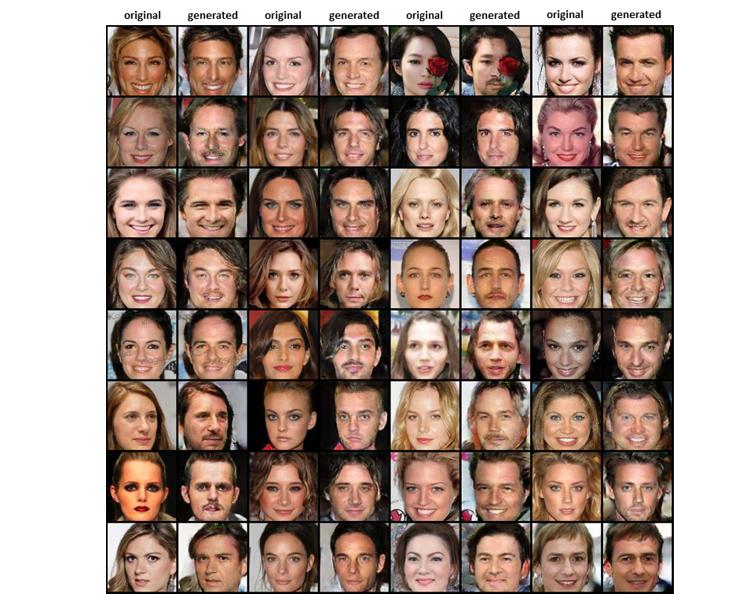
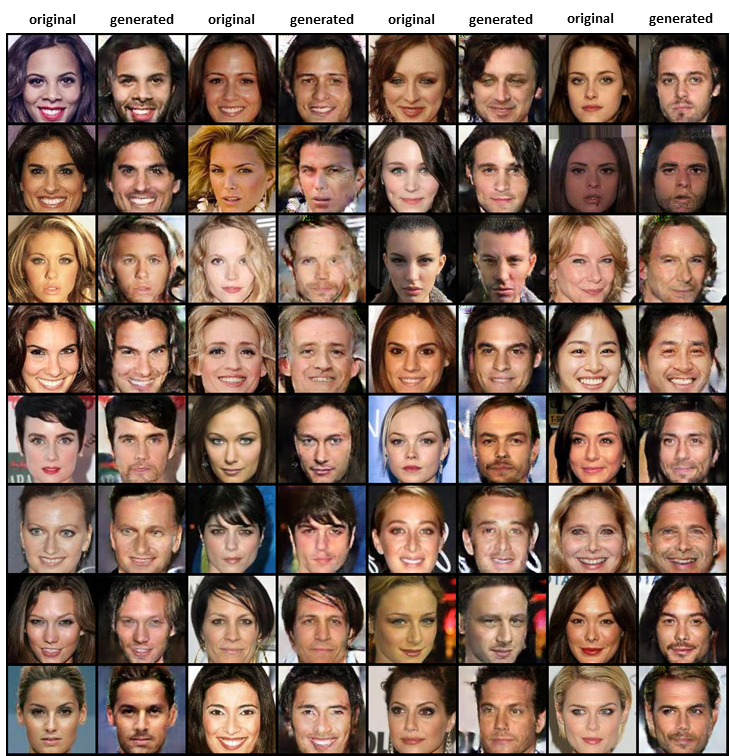
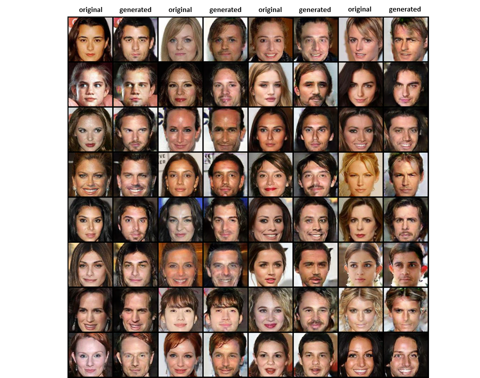
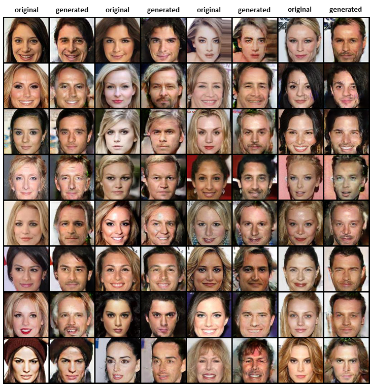
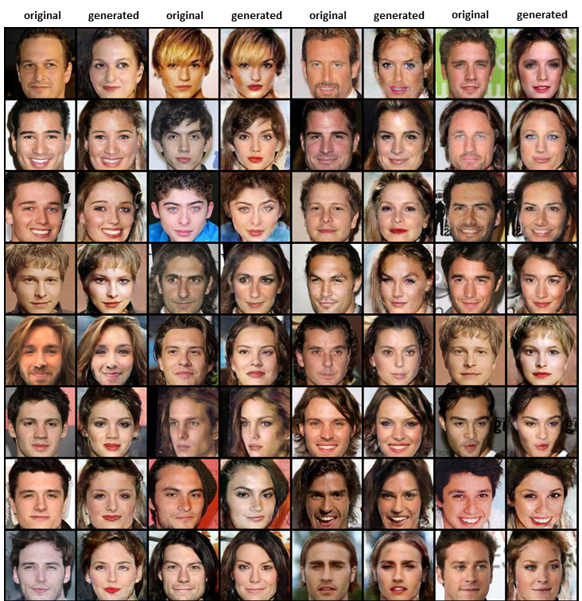
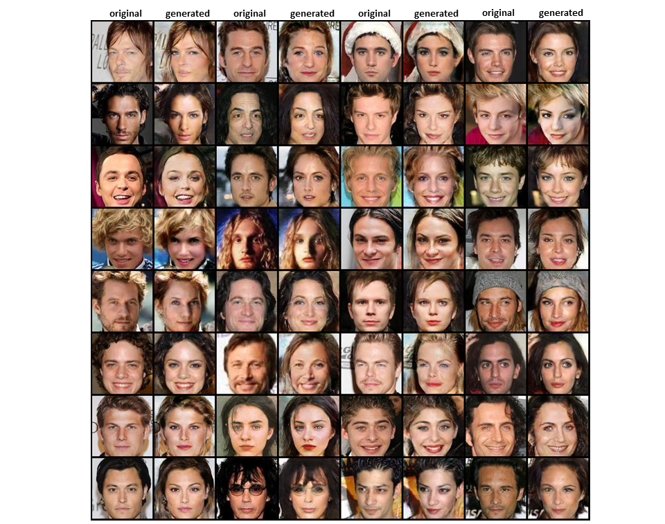
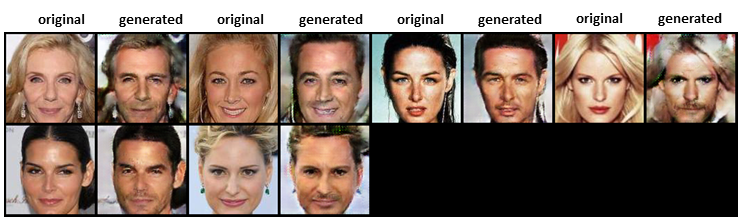

# Multitask-CycleGAN
Implementation of [CycleGAN : Unpaired Image-to-Image Translation using Cycle-Consistent Adversarial Networks](https://arxiv.org/abs/1703.10593) using __pytorch__. 
Futhermore, this implementation is using __multitask learning with semi-supervised leaning__ which means utilize labels of data. This model converts male to female or female to male.
Following image shows improvements such as facial features(make-up, mustache, beard, etc) and image qualities.

<p align="center"></p>
<p align="center"> original : without semi-supervised learning / improved : with semi-supervised learning

## What are differences with original CycleGAN?
1. Batch size 1 -> 16
2. Instance Normalization -> Batch Normalization
3. Model architecture
4. Smooth labeling  
5. __Multitask learning with classification loss (semi-supervised learning)__.

## Effects and Details  
__1. Increasing Batch Size & Replacing Instance Norm with Batch Norm__  
This change makes the model recognize the difference of hair length between male and female. The generator started to draw or erase hair after applying this change.  

__2. Smooth Labeling & Model Architecture Change__  
Basicially, the discriminator easily overwhelms the generator. If it happens, the generator tries to fool the discriminator in an improper way. The balance between discriminator and generator is important for the performance. To solve this problem, smooth labeling is used and model architecture is changed.

__3. No Batch Norm in the First Convolution in Discriminator__  
DCGAN suggests not to use normalization in the first convolution. If you don't follow this, the generator will make images with range of approximately -0.7 ~ 0.7 instead of -1.0 ~ 1.0, the blurry images.

__4. Semi-Supervised Learning with Classification Loss__  
Discriminators need to classify domains not only measure the realism. The weight of classification loss, cls_lambda is 1 for training the discriminators and 0.1 for training generators to encourage the generators to focus more on the realism. The Followings are effects of this change.  
  
* The image quality and clearity increase in most cases.
* The model recognizes the features of each gender such as mustache, beard, color lens and make-up better
* However, recognition of hair length becomes worse.
  
  
## Process
### Discriminator
<p align="center"></p>

### Generator
<p align="center"></p>
  
## Prerequisites
* [Python 3.5+](https://www.continuum.io/downloads)
* [PyTorch 0.2.0](http://pytorch.org/)  

## Dataset
__CelebA__ dataset is used. After downloading the dataset, all images are supposed to be located in the following path.
  
* ```data/train/0``` : Training male images
* ```data/train/1``` : Training female images
* ```data/val/0``` : Validation male images
* ```data/val/1``` : Validation female images
* ```data/test/0``` : Test male images
* ```data/test/1``` : Test female images
  
## Results
<p align="center"></p>
<p align="center"></p>
<p align="center"></p>
<p align="center"></p>
<p align="center"></p>
<p align="center"></p>
<p align="center"></p>
<p align="center"></p>
